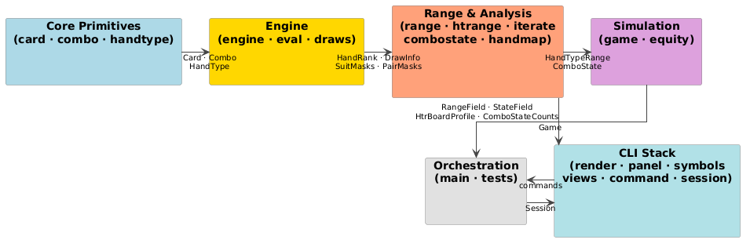

# poker .indev

A poker study tool for range analysis and strategic exploration, written in C with no external dependencies.

This project focuses on making the structural math of poker visible: how ranges interact, how equity shifts across streets, and where strategic pressure emerges.

Not a solver — a tool for understanding.



## Project direction

The long-term goal is an interactive terminal environment for studying poker situations: deal hands, advance streets, observe how ranges evolve, and explore why certain lines apply pressure.

Rather than computing equilibrium strategies, the tool exposes the underlying structure — which hands are ahead, which are vulnerable, where draws activate, how turn and river cards change the strategic balance.

The central idea is to treat hand space as a structured domain and compute *fields* over it:

- **categorical maps** — ahead / behind / drawing
- **scalar maps** — equity, pressure, volatility
- **transition maps** — how ranges evolve across streets
- **frontier maps** — decision boundaries between regions

These maps make it easier to reason about bluffing regions, thin value opportunities, range advantage, and strategic sensitivity to future cards.

## Current status

The mathematical core of the engine is largely implemented:

- exact hand evaluation
- draw classification
- equity computation (exact and Monte Carlo)
- range representation and traversal
- combo-state classification
- hand lattice mapping

Active development is focused on the CLI layer — the interactive session, panel-based layout engine, and multi-view analysis output. The panel system was recently implemented and will support richer dashboards combining hand maps, summaries, transition reports, and debug views. Not everything is wired up yet.

## Build

Requires GCC with C11 support. No external dependencies.

```
make        # build ./poker
make test   # build ./poker_test and run tests
```

## Usage

```
./poker
```

Press `s` at the launch screen to start a session. From the `poker> ` prompt you can deal hands, advance streets, inspect range structure, and run analysis commands. Type `help` to see available commands.

## Architecture

The codebase is organized as layered modules:

```
core/     — Card, Combo, HandType primitives (1–2 bytes each)
engine/   — Hand evaluation, draw detection, board analysis
range/    — Combo ranges (1,326 combos), hand-type ranges (169 classes), set algebra
sim/      — Game state, deal logic, equity calculation
analysis/ — Combo classification, structural range features, range-field construction
cli/      — REPL, session management, panel layout, rendering
```

See `docs/` for UML diagrams of each layer.

## Conceptual model

The project represents hand space as a structured lattice of 169 hand types. Analysis constructs functions over this lattice — *range fields* — that describe structural properties of ranges:

| Field | Description |
|---|---|
| State field | ahead / chop / live draw / dead |
| Draw field | none / gutshot / flush draw / combo draw |
| Pressure field | probability villain overtakes hero |
| Transition field | how states change across streets |

Operators on these fields expose structure: frontier detection (boundaries between strategic regions), transition analysis (equity shifts as new cards arrive), aggregation, and difference maps for comparing lines or board textures.

The goal is a geometric view of range interaction, not just scalar metrics.

## Design characteristics

**Compact representations** — a full 1,326-combo range fits in 168 bytes; hand-type ranges (169 equivalence classes) fit in 24 bytes. These structures keep large numbers of analyses cache-friendly.

**Exact combinatorics where feasible** — equity is computed via exact enumeration when ≤2 cards remain, and adaptive Monte Carlo (10k samples) otherwise.

**Bit-level performance** — bitwise encodings allow fast deck operations, constant-time hand classification, and efficient iteration over combo sets. BMI2 instructions (`_pdep_u64`) accelerate bit extraction when available, with a portable fallback.

## Near-term roadmap

**CLI integration**
- integrate panel layouts into session display
- allow multiple simultaneous views
- stabilize REPL workflows

**Analysis extensions** — planned fields include draw strength maps, robustness maps, volatility maps, transition maps across streets, frontier detection, and line comparison views.

**Range input** — planned support for textual range specification and saved scenarios.

## Non-goals

This project is not attempting to compute Nash equilibria, replace solver software, or provide precomputed strategy charts. The focus is on understanding structure: why certain strategies apply, how ranges interact, where equity shifts occur.

---

*This is an ongoing personal project under active development. Interfaces and outputs are still evolving, particularly in the CLI layer.*
